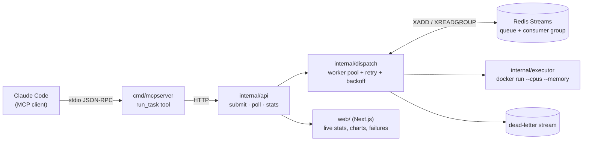

# Relay

A distributed task scheduler in Go that routes AI-agent tool-calls across a
pool of resource-capped Docker workers — built to demonstrate real
distributed-systems mechanics (race-free concurrent dispatch, graceful
degradation under load, crash recovery, retry semantics), not just to wire
existing tools together.

## What it does

An agent (Claude Code, via MCP) asks Relay to run a command. Relay:

1. Queues it durably (Redis Streams), rejecting new work with a clear `503`
   once the system is genuinely overloaded instead of accepting an unbounded
   backlog.
2. Dispatches it to a worker pool sized and capped by a channel-as-semaphore
   — two concurrent dispatches can never claim the same worker, by
   construction, not by convention.
3. Runs it in a disposable, resource-capped Docker container (`--cpus`,
   `--memory`, a hard timeout) — a misbehaving task can't take the host down
   with it.
4. Retries a transient failure (timeout, Docker hiccup) with exponential
   backoff; never retries a deterministic failure (a bad exit code just
   fails the same way twice).
5. Records anything that fails permanently to a dead-letter queue, inspectable
   long after the process that ran it is gone.
6. Reports live queue depth, worker utilization, and P50/P99 latency to a
   real-time dashboard.

## Architecture



Six phases, each independently correctness-tested (see `internal/*/*_test.go`)
and, where it mattered, verified live against a real Docker daemon and real
Redis instance — not just unit-tested in isolation:

| Phase | What it added |
|---|---|
| 1 | Core scheduler: `Task`/`Worker` model, channel-as-semaphore worker pool, Docker execution with enforced limits and leak-proof timeout handling, HTTP API, concurrent load test |
| 2 | Redis Streams queue (replacing the in-process channel), backpressure, retry with backoff, dead-letter queue |
| 3 | MCP server exposing `run_task`, forwarding agent tool-calls into the scheduler instead of executing them locally |
| 4 | Verified under real concurrent multi-session MCP traffic (`cmd/mcploadtest`) |
| 5 | Live Next.js dashboard — queue depth, worker utilization, latency, failure feed |
| 6 | Systematic benchmarking + a direct Relay-vs-raw-execution comparison |

## Engineering decisions worth knowing about

- **Channel-as-semaphore worker pool** (`internal/dispatch/pool.go`): a
  buffered `chan *Worker` pre-filled with N tokens. Acquiring blocks
  automatically when all workers are busy — no mutex, no condition
  variable, and double-assignment is structurally impossible because a Go
  channel delivers each value to exactly one receiver.
- **Deep-copy store reads** (`internal/store`): every `Get` returns a copy
  (including pointer fields), so a caller can never mutate shared state
  behind the store's lock. All writes go through one `Update(id, func)`
  path so a status transition and its timestamp land atomically.
- **Crash recovery via Redis consumer groups** (`internal/queue`): a worker
  that dies mid-task leaves its delivery un-acked; a periodic `XAUTOCLAIM`
  sweep hands it to a live consumer instead of losing it. Verified live by
  `kill -9`-ing a running server mid-task and watching a fresh process
  reclaim the entry.
- **Retryable vs. permanent failure classification**
  (`internal/dispatch/dispatcher.go`): timeouts and executor errors are
  retried with jittered exponential backoff; a deterministic non-zero exit
  is not, because retrying it would just fail the same way again.
- **Soft backpressure**: `Submit` checks queue depth before enqueueing, not
  atomically with it — a deliberate tradeoff (documented in code) favoring
  simplicity over an exactly-enforced admission count, which would need a
  Lua script or a `WATCH`-based transaction for marginal benefit.
- **Queue-only persistence** (a real, named limitation, not an oversight):
  Redis holds the durable queue; task state itself lives in an in-memory
  store. A retry only works within the same process's lifetime — a full
  process restart loses in-flight task history. Closing that gap would mean
  Redis becoming the task database, not just the queue; deliberately left
  out of scope.

## The numbers (full methodology in `benchmarks/results/`)

Measured on an 8-core i7-1165G7 laptop — a shared dev machine under normal
load, not an isolated benchmark box; treat these as directionally real, not
lab-grade precise.

**Throughput & correctness**, sweeping 4 vs. 8 workers × 10/50/100 concurrent
submitters, 3 runs each (18 total), near-instant task (`echo hi`):

- Peak worker utilization matched the configured worker count **exactly, in
  every single run** — the core concurrency-safety claim, under real load.
- Steady-state throughput: **~6.9 tasks/s at 4 workers, ~8.5 tasks/s at 8**
  — sub-linear scaling, attributable to container-execution contention on
  this shared host (see the results file for the full investigation,
  including a caught measurement anomaly that was re-tested rather than
  reported blind).

**Relay vs. raw execution** (`benchmarks/results/relay-vs-raw.md`):

| | Raw `docker run` | Via Relay |
|---|---|---|
| Latency (P50 / P99) | 137ms / 162ms | 159ms / 185ms |
| Overhead | — | ~20-25ms (~16%) for queueing, backpressure, retry, and a durable failure record |

| | Raw, memory-runaway task | Via Relay |
|---|---|---|
| Outcome | Segfault, core dump, **triggered the OS's own crash reporter** | Clean `exit 137`, structured JSON, zero host-side effects |

The raw side was only that clean because I capped it myself for the demo
(`ulimit`) — a genuinely unprotected task has no ceiling at all.

## Running it

```bash
# Redis
docker run -d --name relay-redis -p 6379:6379 redis:7-alpine

# Relay
go build -o relay ./cmd/relay && ./relay -workers 4

# submit a task
curl -X POST localhost:8080/tasks -d '{"image":"alpine","cmd":["echo","hi"]}'
curl localhost:8080/tasks/<id>

# dashboard
cd web && npm install && npm run dev   # http://localhost:3000
```

Full test suite (skips Docker/Redis-dependent tests gracefully if either
isn't running):

```bash
go test -race ./...
```

## Project structure

```
cmd/
  relay/        the scheduler server
  mcpserver/    MCP server exposing run_task
  loadtest/     concurrent HTTP load test
  mcploadtest/  concurrent multi-session MCP load test
internal/
  task/         Task/Spec/Status model
  store/        thread-safe in-memory task store
  dispatch/     worker pool, retry/backoff, backpressure, dead-letter wiring
  executor/     Docker execution (resource limits, leak-proof timeouts)
  queue/        Redis Streams queue + dead-letter queue
  metrics/      rolling-window latency percentiles
  relayclient/  typed HTTP client (shared by loadtest, mcpserver)
  api/          HTTP surface
  testutil/     shared test doubles
web/            Next.js dashboard
scripts/        benchmark.sh
benchmarks/     captured results + methodology
```

## What's not here

Full task-state persistence across a process restart (queue-only
persistence, see above), a light-mode dashboard theme, and dashboard
responsiveness/accessibility below desktop width — known, deliberate gaps,
not oversights.
